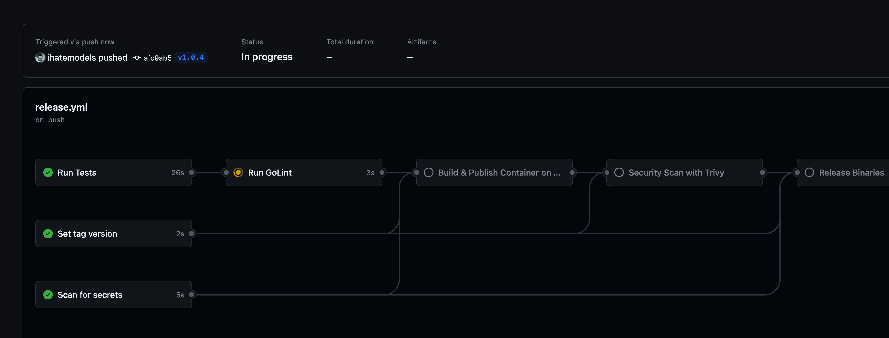

# Alcatraz rest


[https://alcatraz.rest/api/ping](https://alcatraz.rest/api/ping)

`The why you should hire me in a single repo. I may consider selling the domain if hired.` :stuck_out_tongue_winking_eye:


## Table of Contents

- **[About](#about)**
    - **[Structure](#structure)**
    - **[Requirements](#requirements)**
    - **[Running Locally](docs/running.md)**
- **[CI](#ci)**
- **[IaC](#iac)**

### About 

Implementation of an API that returns the hostname of the underlying node and a sender application that:

- Lists the node hostnames
- Counts the number of requests handled by each node
- Counts the number of available nodes

#### **Structure**

```shell
├── cmd # Entrypoints 
│   ├── sender # The Sender application
│   └── server # The Server application
├── iac # Infrastructure as Code implementation
├── internal # Internal sharable code
│   ├── api
│   │   └── v1 # API v1
|   |   └── v2 # API v2 for future use with backwards compatibility imports
│   ├── config # Package for shared configuration
│   └── observability # Package for shared observability
```

#### **Requirements**

Go, GNU Make, Docker, Terraform, Git

#### **Running Locally**

See [Running Locally](docs/running.md) for more details.

### CI



We have a complete CI pipeline that: 

- runs tests and lints via [GoLint](https://github.com/golangci/golangci-lint) on every PR against the main and every push to the main branch.
- scans the code for vulnerabilities using [GitHub CodeQL](https://docs.github.com/en/code-security/code-scanning/automatically-scanning-your-code-for-vulnerabilities-and-errors/about-code-scanning).
- scans the entire git history for secrets leaks via [Gitleaks](https://github.com/gitleaks/gitleaks) on every commit.
- builds the applications and produces multi-arch [Containers](https://github.com/ihatemodels/alcatraz-rest/pkgs/container/alcatraz-rest) on every tag.
- builds the applications and produces multi-arch and multi-os binary builds with [GoReleaser](https://goreleaser.com/) on every tag.


### IaC

We use [Terraform](https://www.terraform.io/) to manage our infrastructure as per the requirements.
